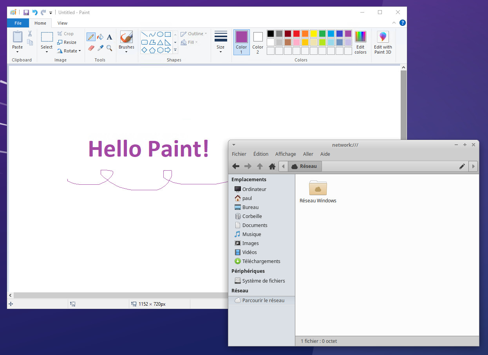

AppPack CLI
===

Run apps from any operating system on your Ubuntu desktop, in a snap.



[Technical documentation](./assets/doc/DOCUMENTATION.md)

⚠️ This has only been tested on XFCE. Feedback is welcome!

## Installation

Copy-paste this in a terminal:
```bash
python3 -c "import urllib.request as r, subprocess as s; s.run(['bash'], input=r.urlopen('https://raw.githubusercontent.com/PaulCombal/appack-cli/master/install.sh').read())"
```

Otherwise, you can find the snap file in the [releases](https://github.com/PaulCombal/appack-cli/releases).

### Why is it not on the Snap Store?

AppPack is still in development, and manual reviewers denied manual review. The main concern is that third party apps can
be malicious. AppPack will warn you when a potential malicious app is trying to be installed, so always check the messages in your terminal when installing an app.

## Add or remove apps

```bash
# Install
appack install myapp.zip
# Uninstall
appack uninstall myapp
# List installed apps
appack list-installed
```

Use the desktop integration to launch an app.

## FAQ

### Is there an app store or marketplace for AppPack?

Not currently, maybe in the future if this project gets some traction.

### Is AppPack production ready?

Absolutely not. AppPack has only been tested on a few configurations.
Please report any issues you encounter to make AppPack better.

### Why is this named AppPack?

AppImage is already taken. I think it's a terrible name that should be changed.
It can be confused with AppImage or Alpine's apk.

### What is the future of AppPack?

Depending on the popularity of the project, many features may be added.
Feel free to express your opinion in the [issues](https://github.com/PaulCombal/appack/issues).

### Can you digitally sign an AppPack?

You can use external signatures for now. A built-in signature system may be added in the future.

### Usage

You can use `--help` in each subcommand to get more information.

```aiignore
Usage: appack <COMMAND>

Commands:
  install         
  uninstall       
  creator         
  list-installed  
  launch          
  reset           
  version         
  info            
  help            Print this message or the help of the given subcommand(s)

Options:
  -h, --help     Print help
  -V, --version  Print version
```